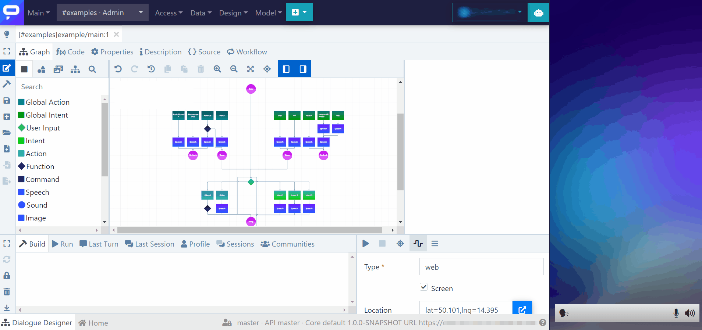
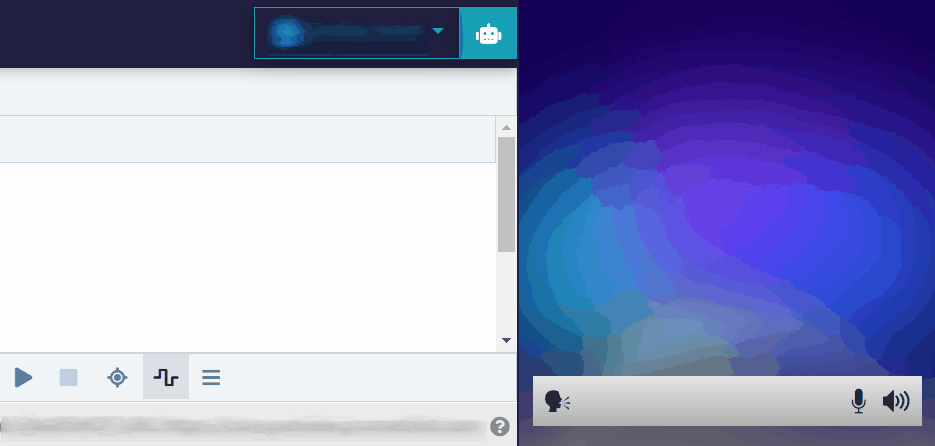

# Build and Test Dialogues

When you are editing a model, you can continuously save your changes, but it's not until you successfully **BUILD** the model that the resulting conversation will be updated. Once the model is built, you can also immediately **RUN** it to test if everything works the way you planned.


If you want to **build the model and run it immediately, just click on Run** – if the model has been changed since the last build, Run will automatically trigger a new build and then immediately start the conversation.


## Build the model

To build a model, just click the Build button – the cute little hammer.

### Build failed

When the build fails, it means that there is something wrong with your dialogue model. What to do?

1. Inspect thoroughly the Build log, which shows the problems that the system has encountered.
2. If that doesn't help, check if your problem is covered in our [FAQ](../../faq.md).
3. If you still have no idea what's gone wrong, refer to our support.

## Run the model

To run a model to test it inside the Dialogue Designer, you have two basic options:

### **Without initial input \(the bot will start\)**

You can just initiate the interaction without any input and let the bot start.

* To do this, just click the Run button \("play"\).
* In this case, `#intro` is sent – meaning "the user has initiated the interaction".

### With initial input \(the user starts\)

You can also initiate the interaction by directly asking something.

* To do this, just input your message via the bot panel.
* In this case, the bot can react to your message right away.
* _Note: this scenario only works if there is a User Input node right after the Enter node, and it will typically be used only in the main dialogue of an application._

