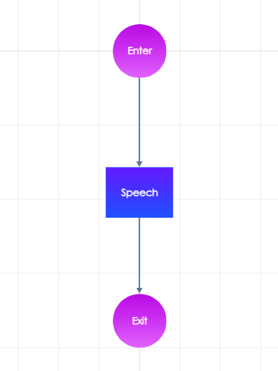

# Design it

### Overall concept

The dialogue NĚCO in the form of a graph, nodes = dialogue flow, propojujou se pomocí small arrows we call transitions

Nodes říkají, kdy má bot mluvit, poslouchat, čemu má rozumět, na základě čeho se má rozhodovat, co si má pamatovat

After [creating](https://docs.promethist.ai/how-to/design/create-dialogue) the dialogue model, in the main editing area of the dialogue designer you will see a basic default structure of built-in nodes. Uvidíte 3 nody \(enter, speech defaultně prázdné, exit\). Let's take a look at všechno, co se tam dá dělat

### Enter the dialogue

In order to start the dialogue, you need to use the \(pink\) **Enter** node. – okopírovat z quick start guidu, musí tam být vždycky jen jeden \(since ten dialogue musí vědět, kde začít\)

### Make the bot speak

The \(blue\) **Speech** node is one of the most important nodes in your dialogue. Here you can specify what your chatbot will say to the user. Click on the node and write the chatbot speech in the **Texts** field in the right panel \(the red circle in the screenshot below\). – co řádka, to je varianta \(tohle basic, pokud víc  –&gt; odkaz na speak flexibliy\)

### Make the bot listen

In order to include the user speech in the conversation, use two following nodes: \(green\) **User Input** node and **Intent** node. \(dva obrázky\)

1. In the left panel **select the "Nodes" tab** \(the red circle in the screenshot below\).
2. Make sure the chatbot will listen while the user is speaking by using the User Input node – **drag and drop it into the graph**.
3. Repeat the same process with the Intent node.
4. Link it to other nodes in the graph by using the **transition** line – hover above the Speech node inside graph and choose one of ports to connect node to another one by dragging **transition**

Předpřipravit na Global Intent

### Exit the dialogue

Just as the **Enter** node, the **Exit** node is necessary to make the dialogue work. At the end of every dialogue, there must be an Exit node whose functionality is not editable in the dialogue designer.

So you have just created the simplest functional dialogue possible but another very important part of the conversation is missing – the user.

### 

