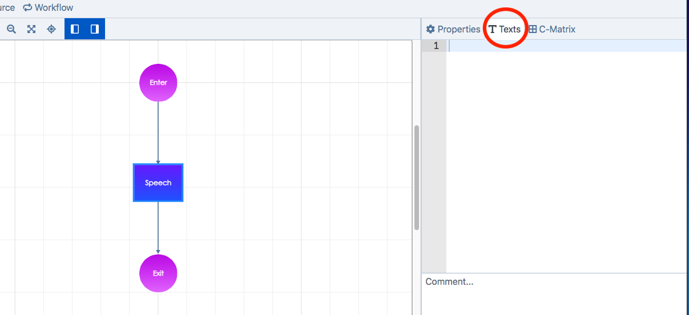

# Design It

## The graph representation

A [dialogue model](../create-dialogue.md) can be represented as a **graph structure**, which can be viewed and edited in the [Dialogue Designer](../../../app/working-space/design/dialogue-designer.md). The structure consists of different types of **nodes**, which represent the stuff that happens during a conversation, such as speaking, listening, or decision-making. Nodes are interconnected by small arrows or "**transitions**", which define the possible paths of a dialogue. Such a visual structure will help you understand clearly the flow of the dialogue.

### Drag and drop

To insert an item \(usually a node\) into the structure, just drag it from the left panel and drop it into the canvas. You can then connect the nodes using transitions.


Before we continue, it must be mentioned that **dialogue models can be interconnected** \(a model can be nested in another model\) and create complex conversational structures. We will talk about this in [another article](../dialogue-linking.md). Here, we will describe the designing process inside **one dialogue model**.


## What can you do with nodes?

Whenever a new dialogue model is [created](https://docs.promethist.ai/how-to/design/create-dialogue), it will open in the Dialogue Designer. In the main editing area, you will see a default built-in structure: Enter—Speech—Exit. But as you can see in the left panel, there are many more types of nodes. Let's see how you can use them to achieve particular designing goals.

### Begin the dialogue flow

Any model must always start with an **Enter** node. This is where the bot will _enter_ the dialogue model and begin the conversational adventure. It goes without saying that each dialogue model must have _exactly one_ Enter node, otherwise the bot wouldn't know where to start!

If you want to begin the conversation differently depending on the context, **Enter** will have to be followed by a **Function**, where you will define the decision process, according to which the flow will branch into multiple paths.

### Leave or suspend the dialogue flow

To indicate that a particular path through the graph has come to an end, use **Exit** / **End** / **Sleep**. What's the difference?

To **leave the current dialogue model**, use the node _**Exit**_. When the bot is running, it will behave like this:

* If the current model is nested in another model, it will _emerge back to that higher level_.
* If the current model is not nested in another model, it will _end the session_.

If you want the bot to **end the running session** \(i.e. end the whole conversation, stop talking\) no matter if the model is nested or not, use the node _**End**_.

* Note: This node is actually not used that much. You will probably want to use it only in quite specific situations \(e.g. when the user says "stop!"\).

If you want to **suspend the conversation but stay in the context** of the session \(so that the user can resume the conversation after a while\), use the node _**Sleep**_. How long should it keep the context? You can set this in the Properties of the node: just type the number of minutes that the bot should wait for session re-start. When the time is out, the session will end in the background.

* Note: Since _Sleep_ doesn't really leave the dialogue flow, it must be always followed by another node. The flow must go on!


Unlike the Enter node, **multiple Exit/End/Sleep nodes** can be inserted into the **same graph**.


### Make the bot speak

The \(blue\) **Speech** node is one of the most important nodes in your dialogue. Here you can specify what your chatbot will say to the user. Click on the node and write the chatbot speech in the **Texts** field in the right panel \(the red circle in the screenshot below\). – co řádka, to je varianta \(tohle basic, pokud víc  –&gt; odkaz na speak flexibliy\)

### Make the bot listen

In order to include the user speech in the conversation, use two following nodes: \(green\) **User Input** node and **Intent** node. \(dva obrázky\)

1. In the left panel **select the "Nodes" tab** \(the red circle in the screenshot below\).
2. Make sure the chatbot will listen while the user is speaking by using the User Input node – **drag and drop it into the graph**.
3. Repeat the same process with the Intent node.
4. Link it to other nodes in the graph by using the **transition** line – hover above the Speech node inside graph and choose one of ports to connect node to another one by dragging **transition**

Předpřipravit na Global Intent

### 

