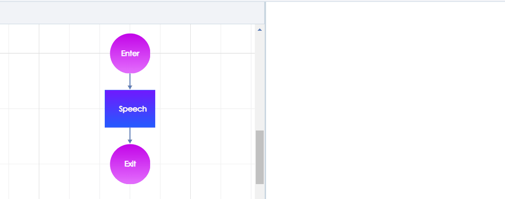
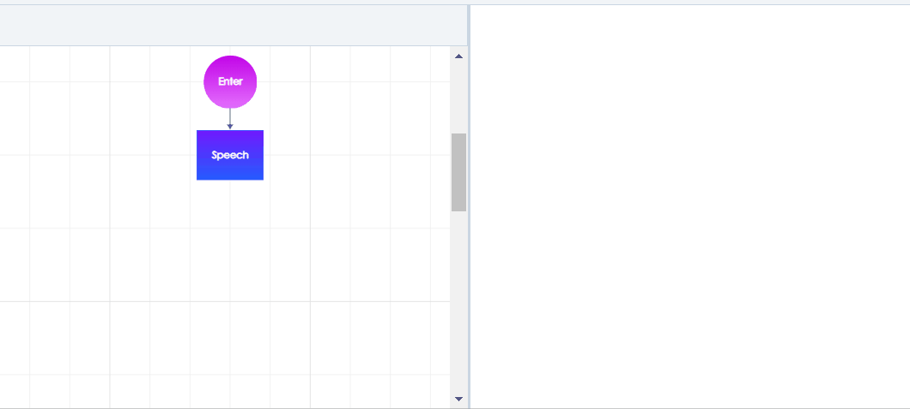
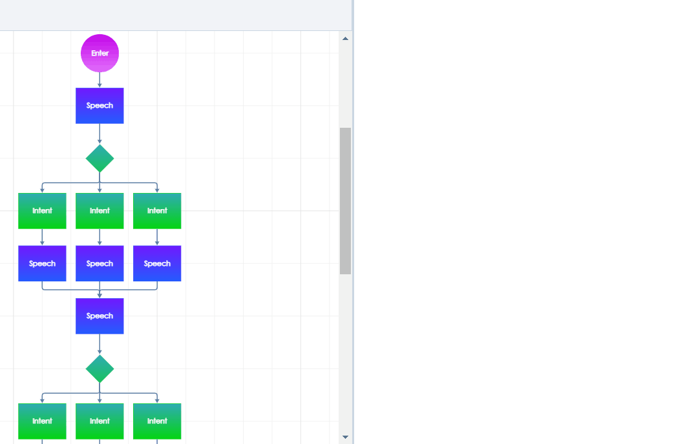

# Design a Dialogue

Whenever a new dialogue model is [created](https://docs.promethist.ai/how-to/design/create-dialogue), it will open in the Dialogue Designer. In the main editing area, you will see a default built-in structure: _Enter --&gt; Speech --&gt; Exit_. But there are many more types of nodes. Let's see how you can use them to achieve particular designing goals.

## Begin the dialogue flow

Any model must always start with an **Enter** node. This is where the bot will _enter_ the dialogue model and begin the conversational adventure. It goes without saying that each dialogue model must have _exactly one_ Enter node, otherwise the bot wouldn't know where to start!

If you want to begin the conversation differently depending on the context, **Enter** will have to be followed by a **Function**, where you will define the decision process, according to which the flow will branch into multiple paths.

## Leave or suspend the dialogue flow

To indicate that a particular path through the graph has come to an end, use **Exit** / **End** / **Sleep**. What's the difference?

**To LEAVE THE THE CURRENT DIALOGUE MODEL**, use the node _**Exit**_. When the bot is running, it will behave like this:

* If the current model is nested in another model, it will _emerge back to that higher level_.
* If the current model is not nested in another model, it will behave like and End node: it will _end the session_.

**If you want the bot to END THE RUNNING SESSION** \(i.e. end the whole conversation, stop talking and forget the session context\) no matter if the model is nested or not, use the node _**End**_.

* Note: This node is actually not used that much. You will probably want to use it only in quite specific situations \(e.g. when the user says "stop!"\).

**If you want to SUSPEND THE CONVERSATION but STAY IN THE CONTEXT** of the session \(so that the user can resume the conversation after a while\), use the node _**Sleep**_. How long should it keep the context? You can set this in the Properties of the node: just type the number of minutes that the bot should wait for session re-start. When the time is out, the session will end in the background.

* Note: Since _Sleep_ doesn't really leave the dialogue flow, it must be always followed by another node. The flow must go on!


Unlike the Enter node, **multiple Exit/End/Sleep nodes** can be inserted into the **same graph**.


## Speak

What the bot says is usually defined in **Speech** nodes. So as you can guess, you will be using these nodes **A LOT**. Using them is pretty straightforward:

1. Click on a Speech node inserted in the graph.
2. In the right panel, choose the tab Texts.
3. Type what the bot should say. Each line = one variant. \(During a conversation, one of the variants will be selected randomly.\)


"Each line = one variant" is just a basic way to achieve flexible speaking abilities. We will talk about other more sophisticated tools [here](../speaking.md).


## Listen and understand

To indicate that it's time to **START LISTENING \(OR WAITING FOR WRITTEN INPUT\)**, connect a _**User Input**_ node.

Now, you will have to define **WHAT SHOULD HAPPEN AFTER THE USER RESPONSE**. The primary solution is to interpret the semantics of the user's message \(our built-in AI will take care of that\). But since there are infinite possibilities of what they could say, it's necessary to define _the most relevant semantic categories, or "intents"_, and indicate which path the flow should take based on the detected intent.

So, to your User Input node, connect those _**Intents**_ that you want to detect at this particular point of the flow. \(These intents will be active only at the point of the flow where they are connected.\) But how do you define the semantics? Let's take it step by step:

1. Insert an Intent node and connect it to the User Input node.
2. Click on the Intent to see the node details in the right panel. Open the "Examples" tab.
3. Write **example phrases** which will define the semantics of the node. Each line = one example phrase. **This is how the AI learns to distinguish between different user intents** which are active at this point of the flow.
4. Continue designing the dialogue flow by connecting new nodes.


**How many example phrases should you type in?**  
It's not about sheer quantity. To best represent the semantic range, try to think of different formulations and synonymic expressions, rather than to list a lot of nearly identical sentences. We will talk about this more in detail in [another article](../understanding.md).


### Globally expectable responses

Some user intents can be expected only in a particular context \(connected to a particular User Input\), but some intents are more general – any requests/questions/remarks that the user can say _at any point_ of the conversation. You could connect such intents to every single User Input, but there's a better alternative: use the _**Global Intent**_ nodes. Global intents are automatically **detected throughout the whole dialogue model \(and all** [**models nested inside it**](../dialogue-linking.md)**\)**. There is no transition leading to them: it's as if they are connected to all User Inputs.

* After some global intents, you will want your bot to **jump back to the point from where the user "deviated"**, and resume the original flow. To do this, use the _**Go Back**_ node.
  * In most such cases, you will also want the bot to **repeat the last text before the global intent**, to indicate the previous context – for this, check the _**"Repeat after going back"**_ box in the Go Back node: the bot will repeat all nodes marked as "repeatable".

A random example of global intents: if you are designing a multi-turn conversational game, you might want to include for instance:

* a global intent meaning _"stop this game"_, because the user can decide to quit the game at any moment; react to it and exit the dialogue flow;
* maybe it is relevant to also cover globally the question _"what is the name of this game?"_; react to it, go back, and repeat the previous line.

The following gif shows how to do it:


There are some **global intents that you should never forget** to include in your application, like "stop", "repeat", or "help". We will talk about them [here](../robustness.md).


## Remember, recall, make decisions, search for information...

We will talk about these advanced abilities in other sections \([Work with context](../context/), [Design more complex logic](../complex-functionality.md)\).

Spoiler: to complete such tasks, you will use primarily the **Function** node. It might seem almost frightening – such a powerful node! But believe us, it will eventually become one of your best node friends.

